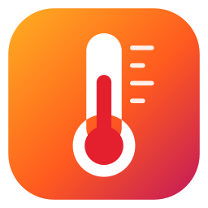

# UTi260B Thermal Studio

**English** | [ภาษาไทย](README.th.md)



A Windows program for the **UNI-T UTi260B** thermal camera. It shows the live image on a PC, measures per-pixel temperatures, logs readings over time, records snapshots and video, and raises temperature alarms. The interface is available in English and Thai.

## Download (Windows)

Download **`UTi260B-Thermal-Studio.exe`** from [Releases](https://github.com/PolarZ5/uti260b-thermal-studio/releases/latest) and double-click it. Python is not required.
- The file is about 95 MB. The first launch can take 10–30 seconds while it unpacks.
- The .exe is not code-signed. If Windows SmartScreen warns, click **More info → Run anyway**.
- Settings are stored in `%APPDATA%\UTi260B Thermal Studio\`. Captures go to `Documents\UTi260B Captures\` by default, and you can change the folder in the program.

## Camera setup

1. On the camera: `SET` → Settings → **USB Mode → USB Camera**
2. Image Mode → **Thermal**. In Fusion/PIP mode, the visible-light part of the image cannot be measured.
3. Keep **Center Spot** on. If you also turn on **Point Temperature**, the program reads those points and uses them for calibration.
4. Plug in the USB-C cable. The program finds and connects to the camera automatically.

> Use a plain 5 V USB-A port. There are reports that USB-C PD fast chargers can damage the camera's power circuit.

No camera yet? Open **⋯ → Demo mode**, which plays the sample images in `samples/`.

## Features

**Main window**
- **Top bar:**
  - camera / connect
  - **📷 Snapshot**
  - **⏺ Record video**
  - 📁 output folder (click to open or change)
  - ⋯ (demo, open BMP, find cameras, UVC driver settings)
  - **TH / EN** language
  - ⚙ **Advanced**
- **Above the image:**
  - tools: Spot / ROI / Exclude
  - eraser (clear spots, ROI, excluded areas)
  - freeze
- **Right panel:**
  - Max / Min / Center / Mean cards
  - spot table (click a spot's coordinates to edit them)
  - the camera's Point Temperature readings
  - palette and high-temperature alarm
- **Advanced** (hidden by default):
  - temperature scale, unit and calibration options
  - clean image and locked color range
  - low-temperature alarm
  - video size
  - capture backend and rotation

**Graph and logging**
- **Logging controls:** press **● Start logging** to record Max, Min, Center, Mean, ROI, spots P1–P6 and camera points P1–P3 at an interval you choose, from every frame up to once a minute. Pause and resume are available.
- **Show or hide lines:** click the line buttons above the graph. Your choice is remembered between sessions.
- **Reading the graph:** hover to read every line at that moment. The time window shows all data or the last 1, 5, 15 or 60 minutes, and a table shows last / min / max / mean for each line.
- **Export CSV** works at any time. When "write the CSV while logging" is on (Advanced › Recording), rows are written as they come in, so nothing is lost if the program closes unexpectedly.

**Files**
| Action | Files | Notes |
|---|---|---|
| 📷 Snapshot | `uti_<time>_view.png`, `_screen.png`, `_temps.csv` (every pixel), `_meta.json` | The screen flashes, and a notice offers to open the folder. |
| ⏺ Record video | `uti_<time>.mp4` + `uti_<time>.csv` (same name) | The button turns red with a timer, and a REC badge appears on the image but is not written into the video. The video length matches real time. |
| ● Start logging (graph) | `uti_<time>_data.csv` | Time series only. |

Shortcuts: `Space` freeze · `Ctrl+S` snapshot · `Ctrl+R` record video · `Ctrl+L` start/stop logging · `Ctrl+1/2/3` tools

**Time-series CSV columns**
`time, elapsed_s, unit, scale_min, scale_max, scale_source, max, max_x, max_y, min, min_x, min_y, mean, center, roi_max, roi_min, roi_mean, P1, P1_x, P1_y … P6_y, cam1, cam1_x, cam1_y … cam3_y`
- Temperatures are in the selected unit.
- Coordinates are pixels on the 240×320 image.
- An empty cell means the value could not be measured in that row.
- Export drops columns that have no data.

## How the measurement works (please read)

In USB Camera mode the UTi260B sends **its screen as color video (UVC)**, not raw temperature data. The program works backwards from the image:

1. It finds the color bar on the right to learn which palette the camera uses.
2. It maps every pixel's color back to a position on that palette (0–254).
3. With OCR, it reads the numbers the camera prints on its screen:
   - the Max/Min at the ends of the color bar
   - the center reading "+ xx.x°C" at the top left
   - the labels of the camera's Point Temperature markers
4. It converts palette positions to temperatures with a **monotone multi-point calibration** through all of those readings: Min → points → Max.
5. It locates the camera's hot and cold markers (red and green brackets), so Max and Min come straight from the camera with the camera's positions.

Result with a real camera: Max, Min and Center match the camera's display. Without the center calibration, values in the middle of the range were about 5 °C off, because the camera boosts contrast before coloring.

Stream details:
- The camera appears as "UVC Camera" (USB VID 1D6B / PID 0102).
- Frames are 240×321 at about 10 fps. The extra padding row is removed.
- Only the DirectShow backend works.

**Limitations**
- **Max / Min / Center / camera points match the camera** because they are the camera's own readings. Every other pixel is an estimate. With a wide temperature range in the scene it can be 1–3 °C off ([background](https://github.com/Santi-hr/UNI-T-Thermal-Utilities/blob/main/docs/temperature_issue.md)). A narrow range is more accurate.
- **Pixels covered by the camera's own text or crosshairs are excluded.** The program detects them automatically, and you can also drag **Exclude** boxes over them.
- **If the camera menu is left open**, it covers the Min label. The program warns you to press Back.
- **Controlling the camera from the PC is not possible:** the UTi260B has no command channel over USB, and UNI-T's own UTi Thermal Analyzer only mirrors the screen. Palette, emissivity, gain, the camera's alarm and saving to SD are set on the camera. This program provides its own PC-side controls instead: palette, color range, spots, ROI, alarms, recording, and the Windows UVC driver dialog.

## Run from source

```bash
pip install -r requirements.txt
```

```bash
python -m uti260b
```

You can also double-click `run.bat`. For a desktop shortcut with the icon, run `powershell -File tools\make_shortcut.ps1`.

When connecting a camera for the first time, `python probe.py` writes device names, VID/PID, supported formats, sample frames and decoder results to `probe_report/`.

## Build the .exe

Use a clean virtual environment so the .exe stays small:

```bash
python -m venv .venv
```

```bash
.venv\Scripts\pip install -r requirements.txt pyinstaller
```

```bash
.venv\Scripts\pyinstaller UTi260B-Thermal-Studio.spec
```

The result is `dist/UTi260B-Thermal-Studio.exe`.

## Project layout

```
uti260b/
  gui/          PyQt6 interface (window, view = image + markers, trend = graph + logging, capture, theme, icons)
  decoder.py    frame -> per-pixel temperatures, overlay masking, calibration
  osd.py        OCR of the color-bar labels and the large center reading
  markers.py    the camera's hot/cold trackers and Point Temperature markers
  measure.py    per-frame measurements (max/min/center/spots/ROI/camera points)
  series.py     time-series recording + CSV
  sources.py    camera capture (OpenCV DirectShow/MSMF) and the demo source
  bmpfile.py    reader for the camera's radiometric .bmp files
  i18n.py       Thai / English text (i18n_en.py holds the English strings)
  palettes.py, render.py, layout.py, paths.py
  assets.npz    palettes + glyph templates (built by tools/build_assets.py)
probe.py        diagnostics for a connected camera
tools/          selftest, asset builder, connection watcher, shortcut script
samples/        sample images (see License)
```

## Troubleshooting
- **The camera connects and drops every 4–5 seconds:** try another USB port or cable. Moving to a different port fixed it during testing.
- **Nothing happens when plugging in:** the cable may be charge-only, or the camera is not set to USB Mode = USB Camera.
- **Watch the connection:** `python tools/watch_camera.py` logs connects and disconnects and tries to grab frames.

## Credits
- BMP format and sample images: [Santi-hr/UNI-T-Thermal-Utilities](https://github.com/Santi-hr/UNI-T-Thermal-Utilities) (MIT)
- USB Camera mode notes: [leftger/uti-thermal-viewer](https://github.com/leftger/uti-thermal-viewer)

## License
[MIT](LICENSE). The sample images `samples/IMG_*.bmp` come from [Santi-hr/UNI-T-Thermal-Utilities](https://github.com/Santi-hr/UNI-T-Thermal-Utilities) under its own MIT License (see `samples/LICENSE-Santi-hr.txt`).
